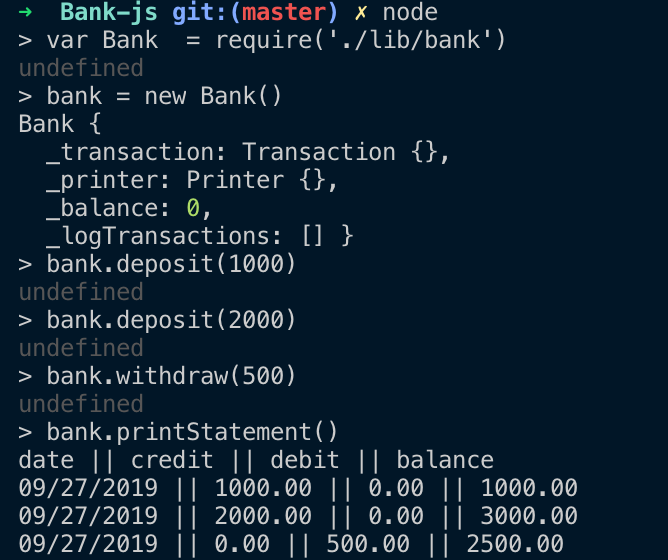

# Bank

Bank app using JavaScript to practice my TDD skills and OO design, producing the best code possible within limited time (2 Days approx).

## Specification

### Requirements

* Deposits, withdrawal.
* Account statement (date, amount, balance) printing.
* Data can be kept in memory (it doesn't need to be stored to a database or anything).

### Acceptance criteria

**Given** a client makes a deposit of 1000 on 10-01-2012  
**And** a deposit of 2000 on 13-01-2012  
**And** a withdrawal of 500 on 14-01-2012  
**When** she prints her bank statement  
**Then** she would see

```
date || credit || debit || balance
14/01/2012 || || 500.00 || 2500.00
13/01/2012 || 2000.00 || || 3000.00
10/01/2012 || 1000.00 || || 1000.00
```

### User story

```
As a user
So that I can add monies to my bank account
I would like to be able make deposits
```

```
As a user
So that I can add user my monies
I would like to be able withdraw monies
```

```
As a user
So that I can see my transactions
I would like to be able print my bank statement
```

### Tech used

* JavaScript
* Jest
* ESLint
* npm & yarn

### Setup

```
run npm install
```

For Testing
```
npm run test
npm test -- --coverage
```

To run EsLint
```
eslint . 
```

### Example of output




